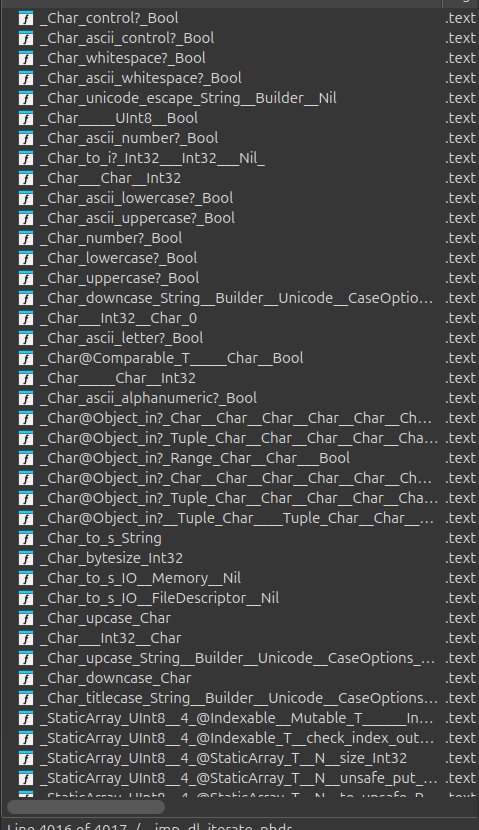
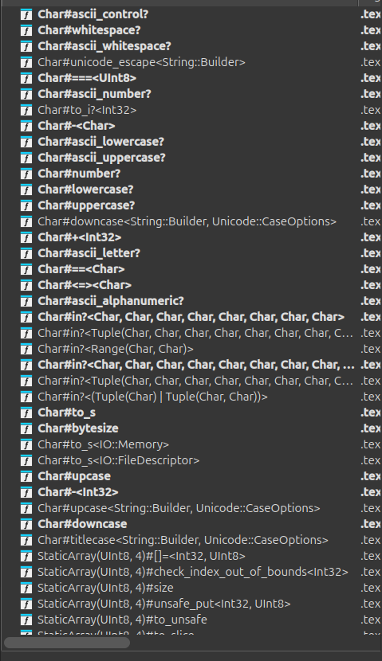
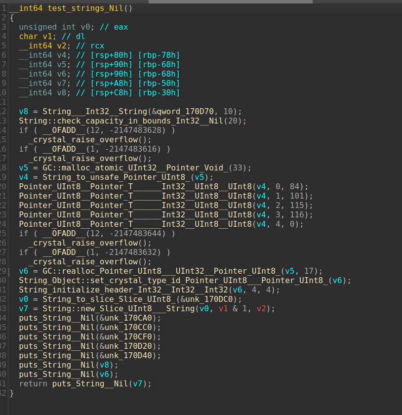
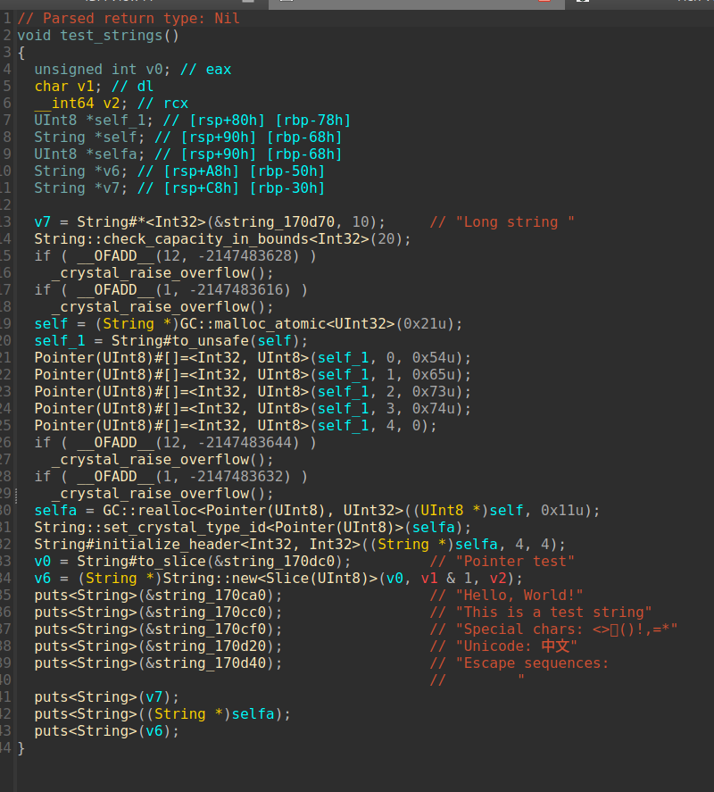
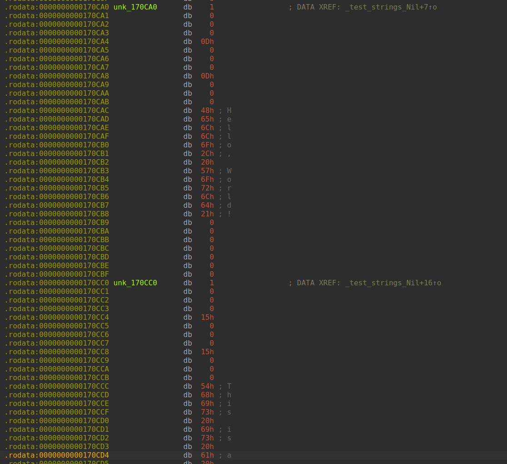
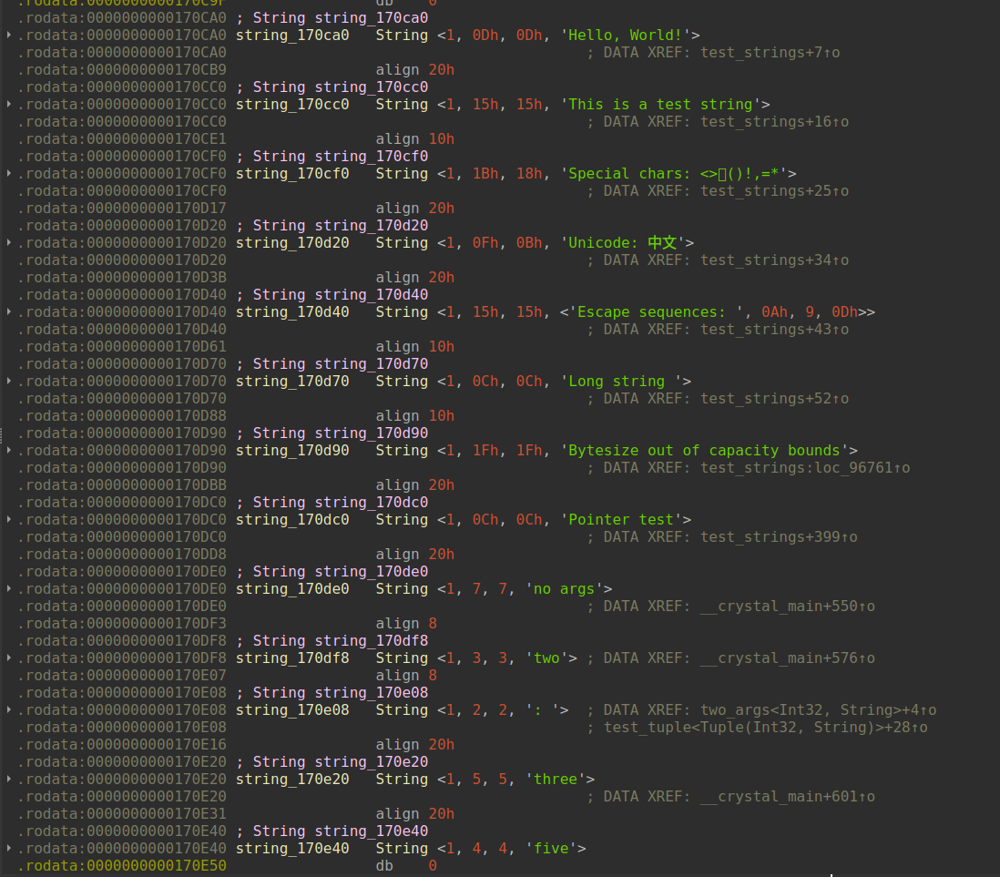

# CrystalRE

## Overview

CrystalRE is an IDA Pro plugin designed to enhance reverse engineering of binaries compiled from the [Crystal programming language](https://crystal-lang.org/). Crystal uses a sophisticated symbol mangling scheme and custom runtime structures that IDA doesn't handle well on its own. This plugin automatically demangles symbols, applies type information, and identifies runtime structures to make Crystal binaries easier to analyze.

### What It Does

**Symbol Demangling**

Crystal encodes rich type information in symbol names, but in a way that IDA doesn't like. This plugin automatically extracts and displays this information in a readable format.

Using the standalone parser in [symbols.py](./crystalre/symbols.py), we can see how these are parsed (a few examples):
```
RVA: 0xaaae0
  Type: FUNCTION
  Original: *Array(Pointer(Void))@Array(T)::new:Array(Pointer(Void))
  Parsed data: {'self_type': 'Array(Pointer(Void))', 'name': 'new', 'return_type': 'Array(Pointer(Void))', 'metaclass': 'Array(T)', 'class_method?': True}

RVA: 0x12a310
  Type: FUNCTION
  Original: *Pointer(Tuple(UInt64, UInt64, String))@Object::==<Pointer(Tuple(UInt64, UInt64, String)).class>:Bool
  Parsed data: {'self_type': 'Pointer(Tuple(UInt64, UInt64, String))', 'name': '==', 'args': ['Pointer(Tuple(UInt64, UInt64, String)).class'], 'return_type': 'Bool', 'metaclass': 'Object', 'class_method?': True}

RVA: 0xef4b0
  Type: FUNCTION
  Original: *Array(UInt64)@Array(T)::new<Int32>:Array(UInt64)
  Parsed data: {'self_type': 'Array(UInt64)', 'name': 'new', 'args': ['Int32'], 'return_type': 'Array(UInt64)', 'metaclass': 'Array(T)', 'class_method?': True}
```

**Automatic Function Signatures**

Using the parsed symbol information, the plugin automatically sets correct function signatures including:
- Accurate argument counts
- Type information where available
- Special return semantics (like NoReturn for functions that don't return)

**String Detection**

Crystal's String type has a specific and predictable runtime layout. The plugin scans the binary to identify and label String objects, making them easy to reference and understand.

**Set `__crystal` Calling Convention Action**

`__crystal` is a custom calling convention the plugin registers. x86_64 compiled binaries use the normal __fastcall convention, but structs that are passed by value typically have the struct's contents "inlined" in the function parameters. Take this function for example:

```crystal
def do_thing(a : Int32, b : Slice(UInt32)) : Nil
end
```

Slice(T) structs are defined like this
```c
struct Slice(T) {
  Int32 size; // offset 0
  Bool read_only; // offset 4
  T* pointer; // offset 8
};
```

Since this struct is <= 32 bytes in size it'll get passed by value. Notice how `size` and `read_only` fit in 8 bytes, so one might think that they can be passed together in a single register (IDA assumes this too!), but that is not the case. Instead, the compiler essentially turns the function into this

```crystal
# NOTE: the symbol still shows Slice(T), this is just to showcase how each member gets split up
def do_thing(a : Int32, b.size : Int32, b.read_only : Bool, b.pointer : Pointer(T))
end
```

So if you set the Slice(UInt8) type as the second arg in IDA, it assumes that `size` and `read_only` get passed in the same register which breaks decompilation outputs. One way to circumvent this is by using __usercall and manually specifying the registers used in the slice param, but that's a lot of manual work and the function prototype ends up looking super ugly.

The solution? Creating a custom calling convention. When you set the `__crystal` calling convention on a function, it'll emulate how __fastcall works, but if it ever encounters a user defined type (udt), it'll extract all the members and let them have their own registers/stack space.

<video src="./media/set_cc.mp4" controls="controls" title="Demo Setting Custom Calling Convention"></video>

## Showcase

<table>
  <tr>
    <th colspan="2"><h3>Function List View</h3></th>
  </tr>
  <tr>
    <td align="center"><b>Before</b></td>
    <td align="center"><b>After</b></td>
  </tr>
  <tr>
    <td></td>
    <td></td>
  </tr>
</table>

<table>
  <tr>
    <th colspan="2"><h3>Decompiled Output</h3></th>
  </tr>
  <tr>
    <td align="center"><b>Before</b></td>
    <td align="center"><b>After</b></td>
  </tr>
  <tr>
    <td></td>
    <td></td>
  </tr>
  <tr>
    <td colspan="2"><i>String contents appear as inline comments in decompiled code and function names are much nicer to read</i></td>
  </tr>
</table>

<table>
  <tr>
    <th colspan="2"><h3>Global String Objects</h3></th>
  </tr>
  <tr>
    <td align="center"><b>Before</b></td>
    <td align="center"><b>After</b></td>
  </tr>
  <tr>
    <td></td>
    <td></td>
  </tr>
  <tr>
    <td colspan="2"><i>String objects are automatically detected, typed, and labeled</i></td>
  </tr>
</table>

## Installation

### Prerequisites

- IDA Pro 9.0 or later with Hex-Rays Decompiler
- Python 3 support enabled in IDA

### Quick Installation (Recommended)

1. Install IDA's [hcli](https://hcli.docs.hex-rays.com/)

2. Install plugin
```bash
hcli plugin install CrystalRE
```

### Manual Installation Steps

1. Install dependencies:
   ```bash
   # Make sure to use the same python installation that IDA uses
   python3 -m pip install pyelftools regex
   ```

2. Copy the plugin files to your IDA plugins directory:
   ```bash
   # On Linux/macOS
   cp crystalre.py ~/.idapro/plugins/
   cp -r crystalre ~/.idapro/plugins/

   # On Windows
   copy crystalre.py %APPDATA%\Hex-Rays\IDA Pro\plugins\
   xcopy /E crystalre %APPDATA%\Hex-Rays\IDA Pro\plugins\crystalre\
   ```

3. Restart IDA Pro

## Usage

The plugin operates automatically on first load. It:

1. Validates the binary is a Crystal executable
2. Parses and applies function symbols
3. Scans for and labels String objects
4. Installs decompiler enhancements

The plugin stores its state in the IDA database, so it won't re-run on subsequent loads. To reinitialize, delete the IDB file and reopen the binary.

## Known Issues

- If a binary has dwarf symbols and you load it with default options, every unhandled function will be of type `int __cdecl ()` and it ruins decompilations. This is an issue with crystal itself and not the plugin. The only way to fix this is to uncheck `Apply calling conventions` and `Function prototypes are definitive` when the _DWARF info_ pop-up appears.
- If a `Proc` contains a closure, the crytsal codegen will inject the closure as the first arg. There's no way of knowing if this closure parameter has been injected from the symbol name alone, so we just assume all procs don't have closures. If you're analyzing a proc and the decomp look messed up, it's probably because the closure is the real first arg.
- Some functions return structs via multiple registers, these do not decompile well and require manual intervention (for now)

## Limitations

- Works best if symbols are included (there's no strip option when building, so most binaries include symbols)
- Type inference limited to types in the IDA database
- Optimized for x86-64 Linux binaries (32-bit binaries likely wont work well)

## Credits

Author: Nico Posada
